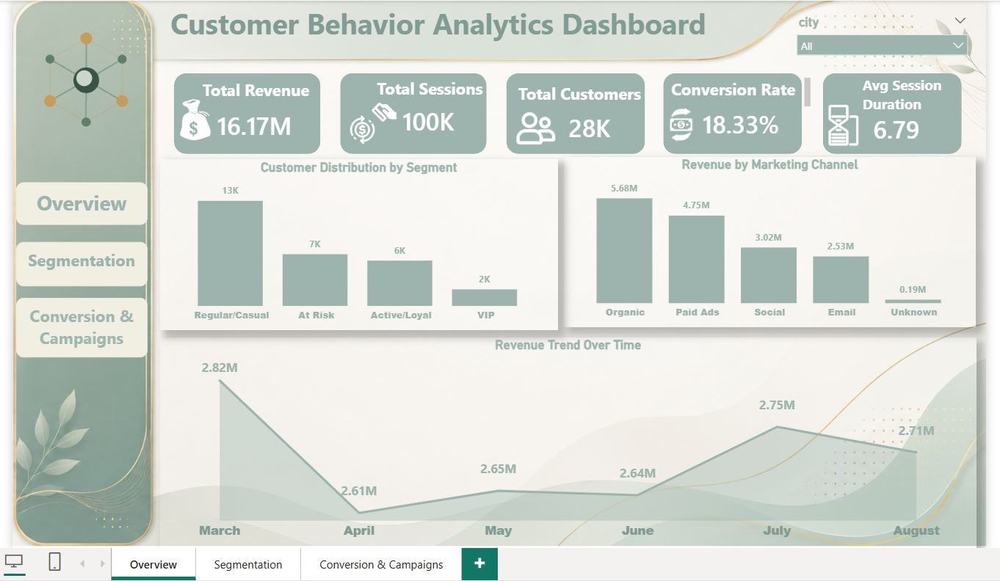
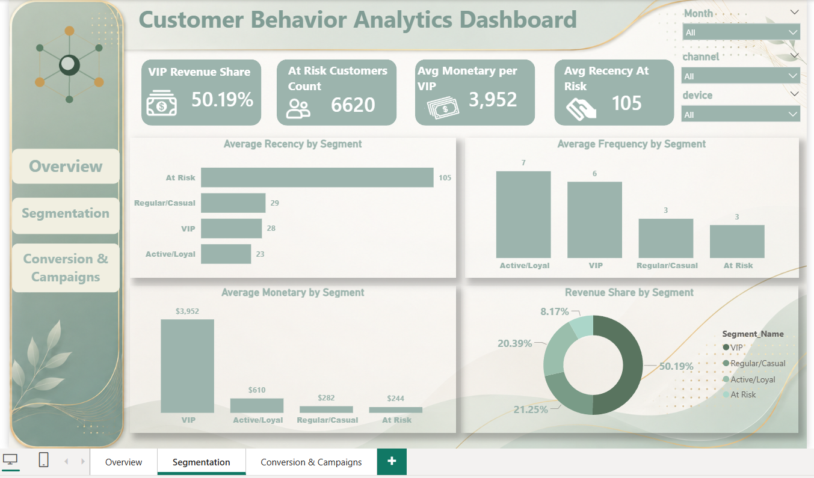

# Customer Behavior Analytics

An end-to-end data analytics project that simulates, cleans, analyzes, and segments e-commerce customer behavior — from a raw dataset to an AI-powered, 3-page Power BI dashboard.

> Built as a graduation project for a Data Analytics track. The full pipeline (data generation → cleaning → RFM → K-Means segmentation → dashboard) mirrors a real-world analyst workflow.

---

## 🎯 Project Overview

This project analyzes **101,000 website sessions from 28,000 unique customers** over a 6-month period, tracking the full journey from **site visit → product view → cart → checkout → purchase**.

The goal wasn't just to report sales numbers, but to understand **customer behavior**: who buys, who returns, who's about to churn — and to turn that into segmented, actionable insight using unsupervised machine learning.

## 🧭 Why Simulated Data?

Several public e-commerce datasets were evaluated first (Olist, REES46, various Kaggle marketing-funnel sets). Each had a blocking issue for this specific analysis — either every customer appeared only once (making frequency analysis impossible), or the data contained internal inconsistencies (e.g., an order value present for a session with no completed purchase).

Rather than work around flawed data, a **logically consistent simulated dataset** was generated in Python: every funnel stage depends on the stage before it, and every financial field is only populated when a purchase actually occurred. See [`data/generate_data.py`](data/generate_data.py).

## 🛠️ Tech Stack

| Layer | Tools |
|---|---|
| Data generation & cleaning | Python, pandas, NumPy |
| Machine Learning | scikit-learn (StandardScaler, K-Means) |
| Visualization | Power BI (DAX measures) |

## 📂 Repository Structure

```
├── data/
│   └── generate_data.py          # Simulates the raw session-level dataset
├── notebooks/
│   └── clean_rfm_segmentation.py # Cleaning → RFM → K-Means → export pipeline
├── dax/
│   └── measures.md               # All DAX measures used in the dashboard
├── assets/
│   └── dashboard_screenshots/    # Preview images of the 3 dashboard pages
└── README.md
```

## 🧹 Data Cleaning

| Issue | Resolution |
|---|---|
| Missing values (logical, e.g. no campaign) | Filled contextually — `"No Campaign"`, `"No View"` |
| Missing values (random) | Filled as `"Unknown"` |
| 991 fully duplicated rows | Dropped |
| Inconsistent text casing (`Mobile`/`mobile`/`MOBILE`) | Standardized via `.str.strip().str.title()` |
| Unrealistic session durations (e.g. 240 min) | Replaced with the column median |

## 📊 Methodology: RFM + K-Means

Three behavioral metrics were computed per customer:

- **Recency** — days since the customer's last session
- **Frequency** — number of distinct sessions
- **Monetary** — total revenue generated

After **StandardScaler** normalization (so no single metric dominates the distance calculation), **K-Means clustering** (`n_clusters=4`) grouped customers into four segments, named by inspecting each cluster's averages:

| Segment | Share of Customers | Share of Revenue |
|---|---|---|
| 🌟 VIP | 8% | ~50% |
| 💚 Active/Loyal | 21% | — |
| 🔵 Regular/Casual | 48% | — |
| ⚠️ At Risk | 24% | avg. 109 days inactive |

## 📈 Dashboard — 3 Pages

**1. Overview** — Total Revenue, Sessions, Customers, Conversion Rate, Avg Session Duration; segment distribution; revenue trend; revenue by channel.



**2. Segmentation** — VIP revenue share, at-risk count, RFM comparison across segments, revenue share by segment.



**3.  Conversion & Campaigns** — Full conversion funnel (Visit → Purchase), cart abandonment, conversion rate by channel, revenue by campaign type.


All DAX formulas are documented in [`dax/measures.md`](dax/measures.md).

## 💡 Key Insights

- Just **8% of customers (VIP) generate roughly half of total revenue** — retention efforts should prioritize this group.
- **24% of customers are "At Risk"**, inactive for ~109 days on average — a clear target for a win-back campaign.
- The steepest funnel drop-off happens between **product view and add-to-cart** (~38% loss) — worth a UX investigation.
- **Discount-driven campaigns outperform** other campaign types in conversion.

## 🚀 How to Reproduce

```bash
pip install pandas numpy scikit-learn

python data/generate_data.py              # generates customer_behavior_funnel_data.csv
python notebooks/clean_rfm_segmentation.py # produces final_dashboard_data.csv
```

Then load `final_dashboard_data.csv` into Power BI Desktop and apply the measures in `dax/measures.md`.

## 📄 License

This project uses simulated data for educational purposes only.
